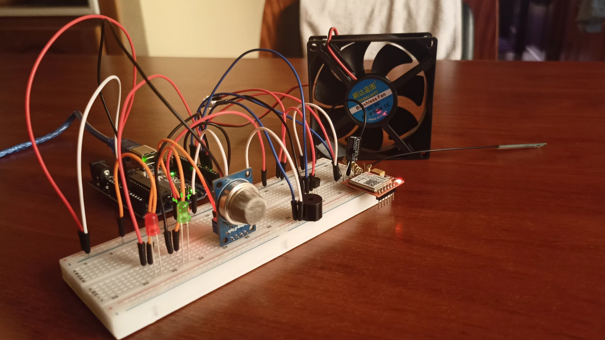
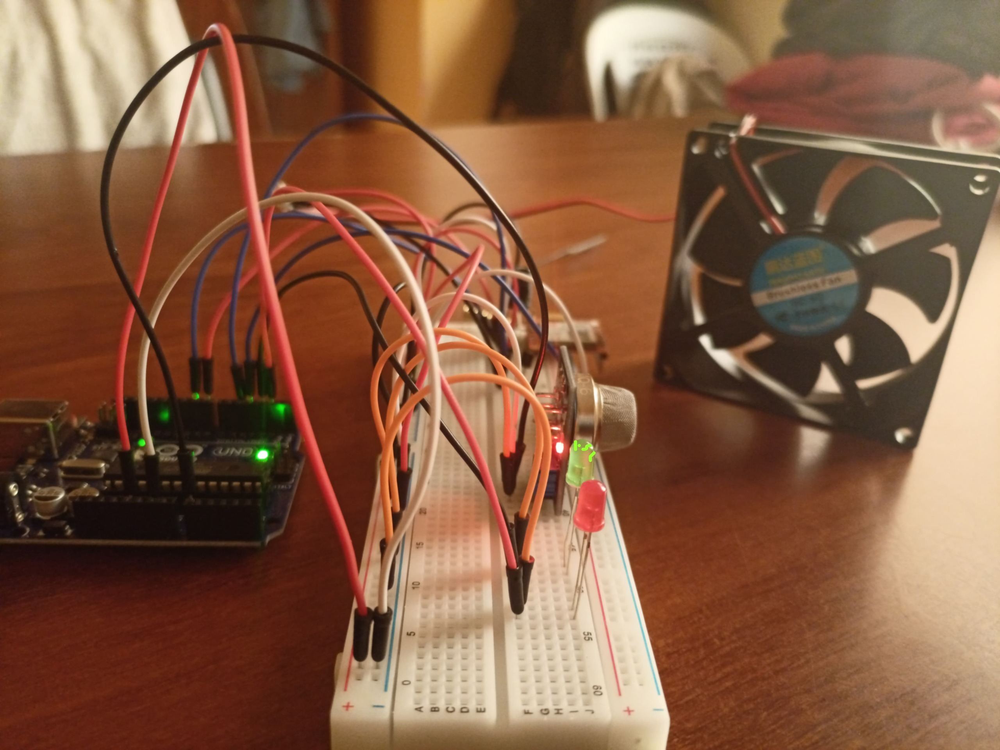
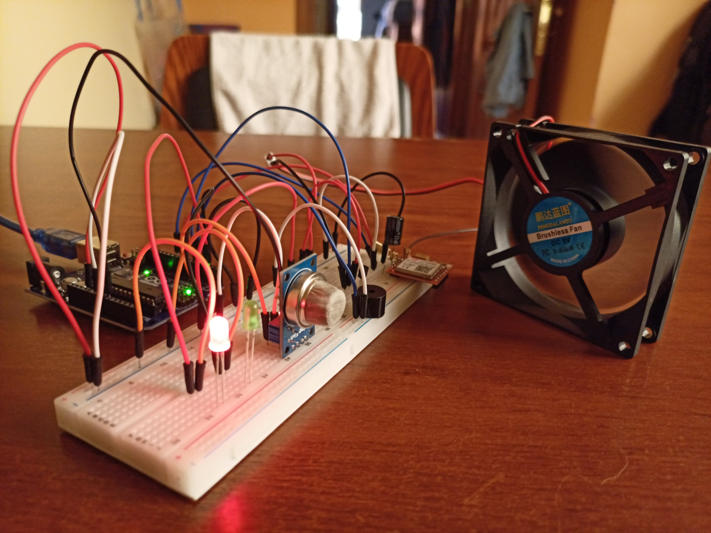
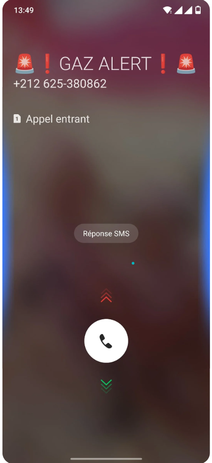
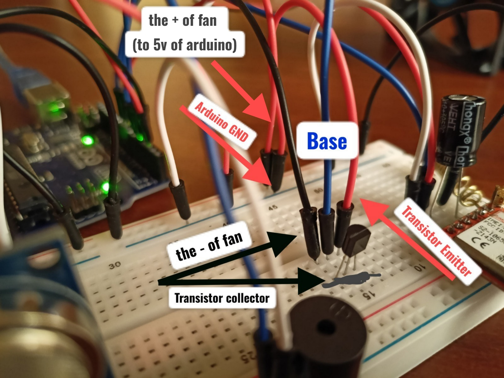
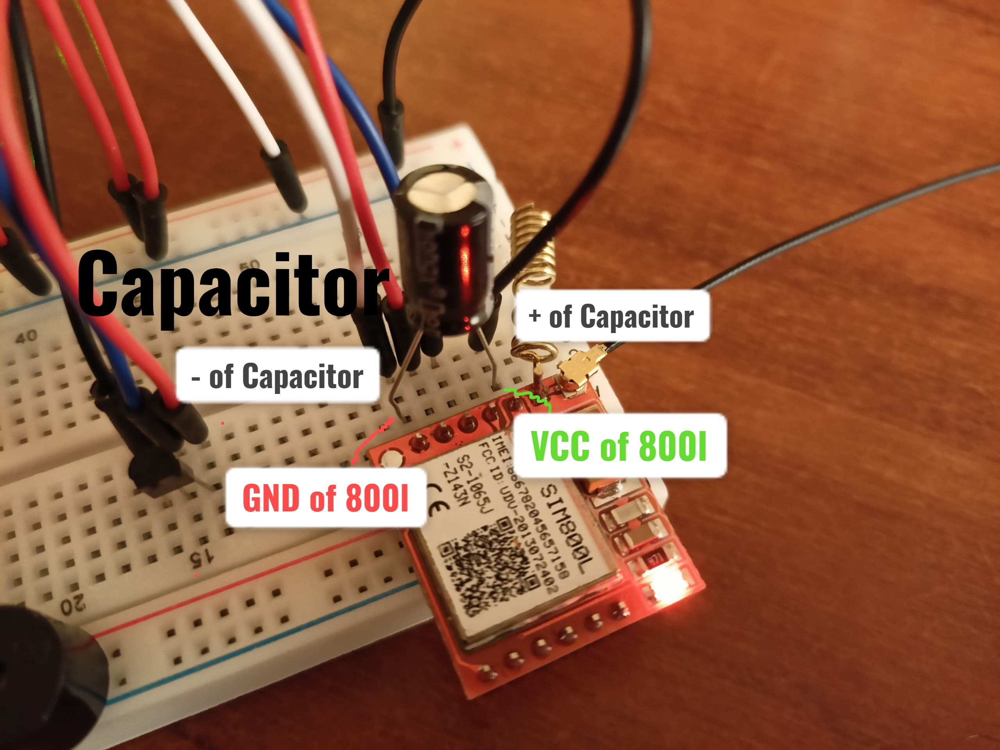
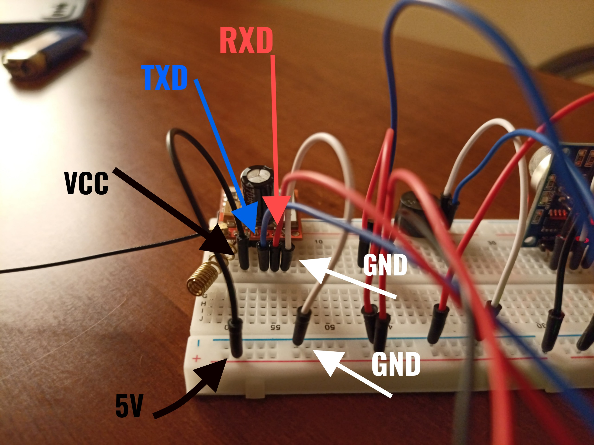
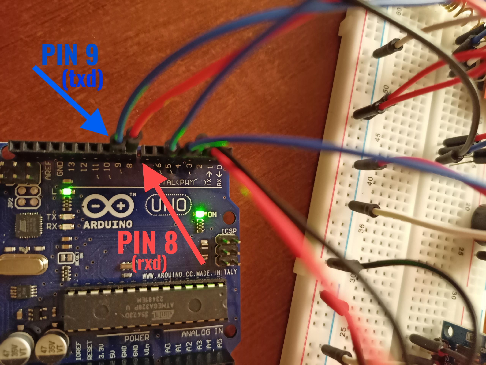

# IOT based Intelligent Gas Leakage Detector Using Arduino 

## Overview 🔍
This project aims to design an intelligent IOT system capable of detecting gas leaks in a given environment. The system uses a gas sensor connected to an Arduino board to monitor, in real-time, the concentrations of flammable or toxic gases. Upon detecting a dangerous concentration exceeding a defined threshold, the system automatically activates a series of safety measures: 
### 🚨*Safety features :*
* 🔴  **A red LED lights up**, and a **buzzer 🔊emits a sound signal** to warn occupants in the area.
* 💨 **Fan Activation** : A fan is activated to ventilate the environment and reduce gas concentration, thereby minimizing the risks of explosion or poisoning.
* 📞 **Automated Emergency Call** : The system uses a SIM800L GSM module to automatically call the user when a gas leak is detected. 
  * This ensures immediate action can be taken, even if no one is present at the location.

## What The Project Looks Like 💁‍♂️
### Normal State ✅

### Gas Leaking State ❗

## Usage 💡
* This system is ideal for **domestic**, **industrial**, or **confined spaces** where gas leaks pose a significant danger. Its modular and scalable design allows for the addition of extra features, such as wireless connectivity for remote notifications or integration with home automation systems.
* The project combines **detection**, **alerting**, and **proactive response**, providing a comprehensive solution to enhance safety and protect users from the dangers associated with gas leaks.

## Used Material ⚒️
* Arduino Uno Board 
* USB cable for PC connection
* JUMPER WIRE
* MQ-6 Propane-Butane-LPG-LNG gas sensor module
* Breadboard 
* Green LED 5mm  (normal status)
* Red LED 5mm  (danger status)
* Transistor
* Active Buzzer 5V
* 5V DC brushless Fan
* Capacitor 470 uF 16 V
* SIM800L V1 Module GSM GPRS

## System's Connection Details ⛓️
### MQ-6 Gas sensor

### LEDs ⭕🟢

### Buzzer 🔊

### Transistor & Fan 💨
* If no current is applied to the base → The transistor is OFF (acts like an open switch).
* If a small current flows into the base → The transistor turns ON, allowing a larger current to flow from collector to emitter powering the fan
* The base is controlled via Pin 5 of arduino

### Capacitor 
* Using a capacitor with the SIM800L GSM module is necessary because the module requires a high current surge (up to 2A during transmission), which most power supplies (especially from Arduino's 5V or 3.3V pin) cannot provide consistently. If the power supply is unstable, the module may restart, hang, or fail to connect to the network.
* When the module transmits, it suddenly draws high current. A capacitor acts as a temporary power reservoir.

### 800L GSM Module 

