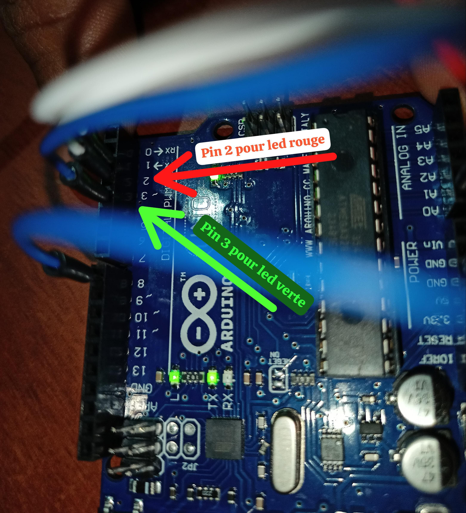

# IOT based Intelligent Gas Leakage Detector Using Arduino 

## Overview 🔍
This project aims to design an intelligent IoT system capable of detecting gas leaks in a given environment. The system uses a gas sensor connected to an Arduino board to monitor, in real-time, the concentrations of flammable or toxic gases. Upon detecting a dangerous concentration exceeding a defined threshold, the system automatically activates a series of safety measures: 
#### *Visual and Sound Alerts :*
* **A red LED lights up**, and a **buzzer emits a sound signal** to warn occupants in the area.
* **Fan Activation** : A fan is activated to ventilate the environment and reduce gas concentration, thereby minimizing the risks of explosion or poisoning.

## What The Project Looks Like 💁‍♂️
### Normal State ✅

### Gas Leaking State ❗

## Usage 💡
* This system is ideal for **domestic**, **industrial**, or **confined spaces** where gas leaks pose a significant danger. Its modular and scalable design allows for the addition of extra features, such as wireless connectivity for remote notifications or integration with home automation systems.
* The project combines **detection**, **alerting**, and **proactive response**, providing a comprehensive solution to enhance safety and protect users from the dangers associated with gas leaks.

## Used Material ⚒️
* Arduino Uno Board 
* USB cable for PC connection
* JUMPER WIRE
* MQ-6 Propane-Butane-LPG-LNG gas sensor module
* Breadboard 
* Green LED 5mm  (normal status)
* Red LED 5mm  (danger status)
* Active Buzzer 5V
* 5V DC brushless Fan

## System's Connection Details ⛓️
### MQ-6 Gas sensor

### LEDs ⭕🟢

### Buzzer 🔊

## Things we will improve 📈

**Adding Wi-Fi Connectivity (IoT)**

Connecting the system to the internet would allow remote monitoring of the data via a dashboard or mobile application.
Send sensor-detected values to a platform like ThingSpeak or Firebase to visualize the data in real time.

**Adding SMS Alerts** 🚨

In case of a gas leak, an SMS alert can be sent to the owner or user.
Integrating a GSM module to send an SMS message.
Once gas is detected, we'll use the module to send an SMS with information such as: "Leak detected on [date and time]."
